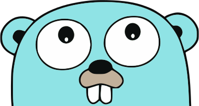

+++
title = "behind the scenes"
date = "2019-01-20"
menu = "main"
+++

## Welcome to the _secret_ behind the scenes

This website is built using [Hugo](https://gohugo.io/) --
a fast and open-source static site generator 
written in [Go](#gopher).
The website's theme is [Hugo ψ](https://github.com/andrejusk/hugo-psi-theme) --
a fork of a Cocoa theme fork.

The source content is hosted publicly 
on [GitHub](https://github.com/andrejusk/andrejusk.github.io).
Each page is stamped with 
its latest commit in the footer.

The `master` branch is built using 
[Google Cloud Build](https://cloud.google.com/cloud-build/)
and deployed on 
[Firebase Hosting](https://firebase.google.com/docs/hosting) 
-- a global CDN powered by SSDs and SSL.

The `develop` branch and outstanding issue PRs
are deployed on Netlify.

***

Bugs? Suggestions? Please file an issue [here](https://github.com/andrejusk/andrejusk.github.io/issues/new/choose).

Is it any good? [yes.](https://news.ycombinator.com/item?id=3067434)

